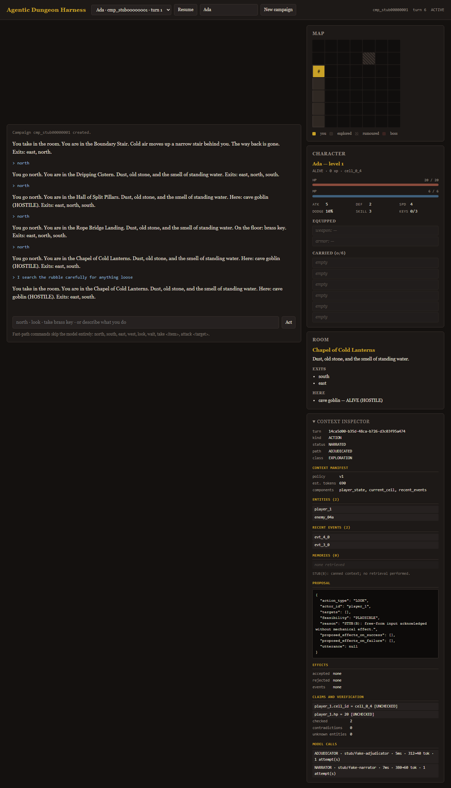

# Many-Lives — Agentic Dungeon Harness

A persistent-world agent harness demonstrated by a turn-based, text-first
dungeon raid. The **harness is the product**; the game is the environment.

**Central invariant:** models may interpret, propose, describe, and reason;
only deterministic application code may establish or mutate canonical game
state.

See the design docs for the full specification:

- `docs/Agentic Dungeon Harness — Design Summary v1.0.md`
- `docs/Agentic_Dungeon_Harness_TDD_v1_1.md` — the implementation spec

## Status

The **end-to-end loop runs**: create a campaign, explore a persistent 7x7
dungeon from the browser, take items, fight, and resume after the server is
killed. Everything was written during the event (26 Sep 2026).

The integration layer (Developer C) talks to the engine and harness only
through the two protocols in `app/services/stubs.py`, so Developer A's Atlas
persistence and Developer B's model calls swap in at one place
(`get_engine()` / `get_harness()`) without touching the API, the orchestrator,
or the UI.

| Layer | State |
|---|---|
| API, turn orchestrator, UI, minimap, character panel, context inspector | working |
| Idempotent turns, fog of war, campaign resume, restart recovery | working |
| Scripted play driver / smoke test (`scripts/play_script.py`) | working |
| Engine and persistence (A) | stubbed behind `EnginePort` |
| Model calls and semantic memory (B) | stubbed behind `HarnessPort` |

## Setup

Requires Python 3.12 or newer.

```bash
python -m venv .venv
.venv/Scripts/activate        # Windows;  source .venv/bin/activate elsewhere
pip install -e ".[dev]"

cp .env.example .env          # never commit .env

pytest                        # the full suite; no database or model needed
uvicorn app.main:app --reload # http://127.0.0.1:8000
```

Open `http://127.0.0.1:8000` and create a campaign. No credentials are needed
to play: without `MONGODB_URI` or `OPENROUTER_API_KEY` the app runs on the
in-memory seam, and every test that would need Atlas skips with a reason
rather than failing.

### Persistence across a restart

To demonstrate the central claim — that continuity comes from stored state and
not from a chat transcript — give the stub engine a state file:

```bash
STUB_STATE_FILE=.state/demo.json uvicorn app.main:app
# play a few turns, then kill the process and start it again
# POST /api/campaigns/{id}/resume returns the same world
```

The browser page reconnects to the campaign it was last on by itself. Only the
campaign id is kept in the browser; the world is reloaded from the store.

### Browser tests

```bash
python -m playwright install chromium   # once
pytest tests/e2e                        # 13 tests in a real Chromium
```

They start their own server on a free port with its own state file. Without
the browser binary they skip rather than fail, so `pytest` stays green on a
machine that has not installed it. Run everything except them with
`pytest -m "not e2e"`.



### Smoke test

```bash
python scripts/play_script.py            # 22 checks; exits 0/1/2
```

Per TDD §32.2 item 7 this runs after every merge; a failure blocks further
merges until it is fixed.

## Layout (TDD §6.2, §25)

```
app/
  domain/       # A — pure rules engine, types, RNG (no I/O)
  world/        # A — topology, placement, room planning, fallback
  harness/      # B — model client, context, adjudicator, narrator, memory, eval
  persistence/  # A — Mongo client, repositories, transactions, indexes
  services/     # campaign / room services, turn orchestrator (integration seam)
  api/          # C — FastAPI routers and schemas
  ui/static/    # C — plain HTML/CSS/JS
config/         # balance.yaml (tuning constants)
scripts/        # indexes, stress history, probe suite, scripted play
tests/          # unit / integration / probes
```

**Dependency rule:** `domain` imports nothing from `harness`, `persistence`,
or `api`; `harness` may import `domain` types; `services` composes all layers.

## The integration seam

`app/services/stubs.py` defines `EnginePort` (Developer A) and `HarnessPort`
(Developer B) and is the single place an implementation is chosen. The turn
orchestrator and every route talk to the protocols only, so swapping in real
code changes nothing else. See issue #7 for the contract and its gotchas.

## Central invariant, enforced

Models may interpret, propose, describe and reason; only deterministic code
establishes or mutates state. Concretely, and covered by tests:

- player text is an *attempted action*, never an authority — prompt-injection
  attempts change no state;
- the adjudicator returns a typed proposal that the engine re-validates;
- dice come from seeded code RNG, never from a model;
- a repeated `turn_id` returns the stored result and applies nothing;
- narration is produced *after* commit and can never alter state; if the
  narrator fails, the turn stays committed and falls back to template text;
- every model- or player-authored string reaches the page via `textContent`.

## Workstreams

Three layers, integrated against shared contracts (TDD §27): **A** engine &
persistence, **B** harness & memory, **C** product & integration.
