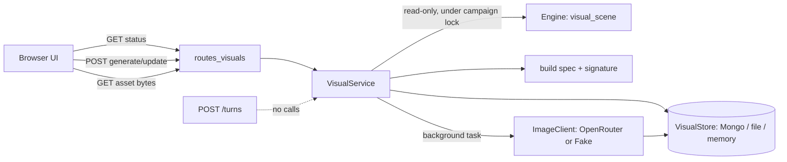

# Room Visuals — Technical Design and Implementation Plan

## 0. How to read this document

This document specifies an optional feature that shows a persisted, visual-novel-style image of the player's current room, and updates that image when the room changes visibly. It is written for the engineer or coding agent who implements it, and for reviewers.

Labels used below:

| Label | Meaning |
|---|---|
| **[VERIFIED]** | Checked against the live repository at commit `6af1218`, or against a live OpenRouter API call made on 26 Sep 2026. |
| **[DECISION]** | A design decision made for this feature. Change only with a recorded reason. |
| **[DEFAULT]** | A tunable value. Change in configuration, not code. |
| **[CHECK]** | Re-verify before relying on it: the code may have moved since `6af1218`. |

Normative words: MUST, MUST NOT, SHOULD, MAY.

**Before writing code, re-run the checks in §3 against the current `origin/main`.** Other developers are merging throughout the day. If a file named here has changed shape, adapt the integration point and record the change in the PR description.

---

## 1. Summary

When the flag is on, each generated room can have an illustration. The illustration is a **read-only projection of committed game state**, exactly as the narrator's prose is. It is never evidence for game state.

- The first image for a room is generated from the room's current state and stored.
- Revisiting the room, or restarting the server, shows **the same stored image bytes**. No model call is made.
- When the room's *visible* state changes (a character crosses a health band, dies, a feature changes state, an item appears or disappears), the stored image is marked out of date. The user (or, if enabled, the client automatically) requests an update. The update edits the previous image using the image model.
- Image generation never runs inside a turn. A failure, a slow model, or the flag being switched off never affects play.

Central invariant for this feature **[DECISION]**:

> Visual artifacts are derived from canonical state and are never read back to determine canonical state. No code in the visuals path writes to campaign, cell, entity, event, memory, or turn data.

---

## 2. Scope

### 2.1 In scope

| Priority | Item |
|---|---|
| P0 | Feature flag; visual panel in the UI; manual "Generate visual"; persistence of image bytes; same image after revisit and after server restart; failure isolation |
| P1 | Visual signature and "out of date" state; manual "Update visual" that edits the previous image |
| P2 | Automatic update when out of date (`AUTO_UPDATE_ROOM_VISUALS=true`) |

### 2.2 Out of scope

Animation, sprites, masks, segmentation, per-character reference sheets, multiple camera angles, images for rooms the player has not discovered, reading images back into game logic, and any change to the turn pipeline.

### 2.3 What the image can show

The image can only reflect state the engine records. On `main` today the engine records: room name and description; features with a free-form `state` dictionary; characters with status and HP; items with a `where` value. States that the engine does not record — for example "beheaded" or "burning curtain" in the current stub — MUST NOT be drawn, because the picture would then contradict the game's own state. When the engine adds such states, they appear in the image automatically through the feature-state dictionary (§6).

---

## 3. Findings from the live repository **[VERIFIED at `6af1218`]**

These facts drive the design. Re-check each before implementing.

| # | Fact | Where | Consequence |
|---|---|---|---|
| F1 | Settings are a `pydantic_settings.BaseSettings` class with `env_file=".env"`, cached by `@lru_cache get_settings()`. | `app/config.py` | New settings are added as fields. Tests that change them must call `get_settings.cache_clear()`. |
| F2 | Routers are included in `app/main.py`, then the static UI is mounted at `/` **last**. Errors use the `{"error": {"code", "message"}}` envelope via exception handlers, including `HTTPException`. | `app/main.py` | Add the new router with the other `include_router` calls, before the static mount. Raise `HTTPException` to get the envelope for free. |
| F3 | The engine is chosen in one place, `_build_engine()` in `app/services/stubs.py`: `FileBackedEngine` when `STUB_STATE_FILE` is set, otherwise the in-memory `StubEngine`. There is **no Atlas-backed world engine on `main`**. | `app/services/stubs.py` | World state may live in a JSON file or in memory. The visual store must not assume Atlas (§8). |
| F4 | Atlas is used by the harness (memories, turns metrics) only when `MONGODB_URI` is set and `USE_FAKE_MODELS=false`, via `app.persistence.mongo.get_database()`. That function requires `MONGODB_URI` and `MONGODB_DB`. | `app/services/stubs.py` `_build_harness`, `app/persistence/mongo.py` | The Mongo visual store reuses `get_database()`. |
| F5 | The wire model `VisibleCharacter` has `id, name, status, disposition` — **no HP**. Internally, `_Character` has `hp` and `max_hp`. | `app/api/schemas.py`, `app/services/stubs.py` | Health bands need HP. Add a read-only engine method rather than changing the wire schema (§7). Do not add fields to `VisibleCharacter`: `TurnResult` and existing tests depend on it. |
| F6 | `VisibleFeature.state` is `dict[str, str]`; the stub uses keys such as `posture` and `lit`, not the TDD's closed vocabulary. | `app/services/stubs.py` `_dress` | The visual spec copies the state dictionary generically; it must not hard-code key names. |
| F7 | The orchestrator serializes turns with a per-campaign `threading.Lock` obtained from `_lock_for(campaign_id)`. Endpoints are synchronous `def`. | `app/services/turn_orchestrator.py` | Read the scene under that lock for a consistent snapshot. Never hold it during an image call. |
| F8 | Debug routes return **404** (not 403) when their flag is off. | `app/api/routes_debug.py` | Visual routes follow the same pattern. |
| F9 | The UI is plain JS. `renderRoom(cell)` draws `#room`; `applyTurnResult(result)` runs after every turn; resume runs through `resumeCampaign`. The `api()` helper throws on non-2xx with `error.status`. | `app/ui/static/app.js`, `index.html` | Hook visuals into `applyTurnResult` and resume. Treat a 404 from the visual status route as "feature off". |
| F10 | `tests/integration/ui_render_check.js` evaluates `app.js` with `new Function(document, window, crypto, fetch, CustomEvent)` and a stub DOM whose `getElementById` creates elements on demand. It returns `renderMinimap, renderCharacter, renderRoom, rememberCampaign, lastCampaign, renderInspector`. | tests | New code MUST NOT run work at load time, MUST NOT reference browser-only globals (`Image`, `URL.createObjectURL`) at load time, and MUST NOT change the signatures of the returned functions. |
| F11 | Integration tests use database `dungeon_test` and clear only the collections in `_OWNED_COLLECTIONS`. | `tests/integration/conftest.py` | Add the two new collections to that tuple so tests clean them. |
| F12 | Dependencies: `openai` is a runtime dependency; `httpx` is dev-only; there is a `uv.lock`. | `pyproject.toml` | Call the image API with the standard library (`urllib.request`) so no dependency or lockfile change is needed. |
| F13 | `.env` is git-ignored; `.env.example` lists names only. The repository is public. | `.gitignore`, `.env.example` | The OpenRouter key goes only in `.env`. Never in code, docs, tests, or logs. |

### 3.1 OpenRouter image API **[VERIFIED by live calls, 26 Sep 2026]**

| Item | Observed |
|---|---|
| Endpoint | `POST https://openrouter.ai/api/v1/images`, header `Authorization: Bearer <key>` |
| Response | `{"created": …, "data": [{"b64_json": "<base64>", "media_type": "image/jpeg"}], "usage": {…, "cost": …}}` |
| Model used | `openai/gpt-image-1-mini` |
| Aspect ratio | `"16:9"` **rejected with HTTP 400** for this model ("Accepted: 1:1, 3:2, 2:3, auto"). `"3:2"` works. Supported ratios differ by model. |
| Parameters that worked | `aspect_ratio: "3:2"`, `quality: "low"`, `output_format: "jpeg"`, `output_compression: 70` |
| Generation | 1536×1024 JPEG, ≈70 KB, ≈8 s, cost $0.0033 |
| Edit | Same parameters plus `input_references: [{"type": "image_url", "image_url": {"url": "data:image/jpeg;base64,…"}}]`. ≈8 s, cost $0.0071. |
| Edit fidelity | The edit applied the requested change (standing demon became kneeling and wounded) and kept the architecture, camera, and lighting, **but dropped the altar and candles** despite an instruction to keep everything else. |
| Billing | OpenRouter documents that a failed generation is not billed. |

Consequences: the model and aspect ratio MUST be configuration; every edit prompt MUST restate the full scene, not only the change (§9.3); the design MUST NOT claim pixel-exact consistency across edits. The exact reuse guarantee applies only when nothing visible has changed.

---

## 4. Architecture



| Component | File (new unless stated) | Responsibility | Writes |
|---|---|---|---|
| Config | `app/config.py` (edit) | Feature settings (§11) | — |
| Engine read | `app/services/stubs.py` (edit: one method on `StubEngine`) | `visual_scene(campaign_id, cell_id)` read-only snapshot with HP | Nothing |
| Spec + signature | `app/services/visual_spec.py` | Build `VisualSceneSpec`, health bands, canonical JSON, SHA-256 signature, spec diff | Nothing |
| Image client | `app/services/image_client.py` | `OpenRouterImageClient` (urllib) and `FakeImageClient` | Nothing |
| Store | `app/services/visual_store.py` | `MongoVisualStore`, `FileVisualStore`, `MemoryVisualStore`; atomic claim; revision cap | Only visual collections/files |
| Service | `app/services/visual_service.py` | Status, claim, generate/edit, persist, failure handling | Through the store only |
| API | `app/api/routes_visuals.py`; new models in `app/api/schemas.py` (append only) | Three endpoints (§10) | — |
| UI | `app/ui/static/index.html`, `app.js`, `styles.css` (edit) | Visual panel, buttons, polling | — |

All new files are in Developer C's areas (`app/api/`, `app/services/`, `app/ui/`). `stubs.py` is Developer C's file. No change is made to `app/domain/`, `app/world/`, `app/persistence/`, or `app/harness/`; the Mongo store only calls the existing `get_database()`.

---

## 5. Invariants

| ID | Invariant | Verified by |
|---|---|---|
| VIS-01 | No visuals code writes campaign, cell, entity, event, memory, or turn data. | Code review; test that engine state is byte-identical before and after generate/update |
| VIS-02 | `POST /turns` and `resume` never call the visual service or the image client. | Test with a client that fails on any call; turns still pass |
| VIS-03 | With `ENABLE_ROOM_VISUALS=false`, every visual route returns 404, the panel stays hidden, and the full existing test suite passes unchanged. | Run full suite with flag off and on |
| VIS-04 | If the stored signature equals the current signature and status is READY, no image call is made; the same asset bytes are returned. | Unit + API test counting client calls |
| VIS-05 | At most one generation per (campaign, cell) runs at a time. | Concurrent POST test |
| VIS-06 | Every read and write is scoped by `campaign_id`; visuals exist only for cells the player has discovered. Asset IDs from another campaign return 404. | API tests |
| VIS-07 | An image failure is recorded as `FAILED` with a short code and never raises into turn handling. | Failing-client test |
| VIS-08 | The API key never appears in responses, logs, exceptions surfaced to the client, stored records, or git. | Grep test on responses/logs; `git diff` check |
| VIS-09 | Nothing reads image bytes to decide state. | Code review |

---

## 6. Visual scene spec and signature **[DECISION]**

### 6.1 Health bands

Integer arithmetic only (avoid float boundary errors):

| Band | Condition (`max_hp > 0`) |
|---|---|
| `DEAD` | `status == "DEAD"` or `hp <= 0` |
| `CRITICAL` | `hp * 100 <= 10 * max_hp` |
| `SEVERE` | `hp * 100 <= 25 * max_hp` |
| `WOUNDED` | `hp * 100 <= 50 * max_hp` |
| `HEALTHY` | otherwise |
| `UNKNOWN` | HP not available from the engine (fallback path, §7.2) |

Checks run top to bottom. Examples with `max_hp = 6`: hp 6 → HEALTHY; 3 → WOUNDED (300 ≤ 300); 1 → SEVERE (100 ≤ 150); 0 → DEAD.

Visual descriptions per band are deliberately non-graphic (image services may refuse gore):

| Band | Phrase used in prompts |
|---|---|
| HEALTHY | "unhurt" |
| WOUNDED | "bruised and scuffed, armour or clothing torn" |
| SEVERE | "badly hurt, bloodied bandage-level wounds, stooped" |
| CRITICAL | "barely standing or kneeling, exhausted" |
| DEAD | "lying motionless on the floor" |
| UNKNOWN | (no condition phrase) |

### 6.2 `VisualSceneSpec`

A Pydantic model (in `visual_spec.py`, `extra="forbid"`):

```text
VisualSceneSpec
  style_version: int                 # STYLE_VERSION constant; bump to invalidate all images
  cell_id: str
  room_name: str
  description: str                   # room description text from the engine
  features: list[{id, name, state: dict[str,str]}]     sorted by id; state copied verbatim
  characters: list[{id, name, description, status, band}]  sorted by id
  items: list[{id, name, where}]     only items located in the room (not player inventory); sorted by id
```

Disposition is **excluded** [DECISION]: it changes often and is not reliably visible, and including it would cause unnecessary regenerations.

### 6.3 Signature

`signature = "sha256:" + hex(sha256(json.dumps(spec.model_dump(), sort_keys=True, separators=(",", ":"), ensure_ascii=False).encode("utf-8")))`

Properties to test: identical state → identical signature across processes; reordering characters/features in the engine does not change it; an HP change within a band does not change it; crossing a band does; any feature-state change does; an item leaving the room does.

### 6.4 Spec diff

`diff_specs(old, new) -> list[str]` produces plain-language change lines used in edit prompts, for example `"cave goblin: now badly hurt, bloodied, stooped"`, `"wooden chair: posture changed from upright to overturned"`, `"brass key: no longer in the room"`, `"iron brazier: lit changed from unlit to lit"`. Unknown keys are rendered generically as `"<name>: <key> changed from <a> to <b>"`.

---

## 7. Engine integration

### 7.1 New read-only method on `StubEngine` **[DECISION]**

Add to `StubEngine` in `app/services/stubs.py` (inherited by `FileBackedEngine`):

```text
def visual_scene(self, campaign_id: str, cell_id: str) -> dict | None
```

- Returns `None` if the campaign is unknown, the cell does not exist, the cell is not generated, or the cell is not in the campaign's discovered set (VIS-06). **[CHECK]** the attribute names `camp.cells`, `camp.discovered`, `cell.generated` at implementation time.
- Returns plain data built from internal objects: `name`, `description`, features (`id`, `name`, `state` copy), characters (`id`, `name`, `status`, `hp`, `max_hp`, and `description` if the character object has one, else `""`), items located in the cell (`id`, `name`, `where`).
- MUST NOT mutate anything and MUST NOT call `_save()`, `generate_room`, or `_dress`.

It is not added to the `EnginePort` Protocol, so Developer A's future engine is not obliged to implement it.

### 7.2 Fallback for other engines

`VisualService` calls `getattr(engine, "visual_scene", None)`. If absent (for example, when Developer A's Atlas engine replaces the stub), it builds the scene from `engine.load_world_view(...)` for the **current cell only**, with every character band `UNKNOWN`. Health-band updates are then unavailable, but generation and persistence still work. Record this in the PR as a "Needs from A" item: implement `visual_scene` on the Atlas engine.

### 7.3 Consistent snapshot

`VisualService` reads the scene inside `with _lock_for(campaign_id):` (import from `app.services.turn_orchestrator`), so it never observes a half-applied turn. The lock MUST be released before any image call. **[CHECK]** that `_lock_for` still exists; if it is renamed, use the new equivalent and note it.

---

## 8. Persistence

### 8.1 Store selection **[DECISION]**

`VISUAL_STORE=auto|mongo|file|memory` (default `auto`):

- `auto` → `mongo` if `MONGODB_URI` and `MONGODB_DB` are set; else `file` if `STUB_STATE_FILE` is set; else `memory`.
- `memory` loses images on restart; it exists for tests and for runs with the in-memory engine (whose campaigns are also lost on restart).

For the demo, use the same durability as the engine: if the engine uses `STUB_STATE_FILE`, images survive a restart in either the file or Mongo store.

### 8.2 Records

`RoomVisualRecord` (one per campaign + cell):

```json
{
  "_id": "<campaign_id>:<cell_id>",
  "campaign_id": "cmp_…",
  "cell_id": "cell_3_2",
  "status": "NONE | GENERATING | READY | FAILED",
  "revision": 3,
  "signature": "sha256:…",
  "spec": { "…": "VisualSceneSpec of the current asset" },
  "current_asset_id": "va_…",
  "base_asset_id": "va_…",
  "edits_since_base": 2,
  "generation_started_at": "2026-09-26T19:12:03Z",
  "error_code": null,
  "model": "openai/gpt-image-1-mini",
  "updated_at": "…"
}
```

`VisualAsset`:

```json
{
  "_id": "va_<uuid4hex>",
  "campaign_id": "cmp_…",
  "cell_id": "cell_3_2",
  "revision": 3,
  "signature": "sha256:…",
  "media_type": "image/jpeg",
  "bytes": "<BSON Binary>",
  "size": 71234,
  "model": "openai/gpt-image-1-mini",
  "kind": "GENERATE | EDIT",
  "created_at": "…"
}
```

### 8.3 Mongo store

Collections `room_visuals` and `visual_assets`. Indexes: `room_visuals` unique `{campaign_id: 1, cell_id: 1}`; `visual_assets` `{campaign_id: 1, cell_id: 1, revision: -1}`. Create them lazily on first use with `create_index` (idempotent) — do not edit `app/persistence/indexes.py`.

Images are stored as BSON `Binary` inside the asset document. At ≈70 KB per image, documents are far below MongoDB's 16 MB document limit, so GridFS is unnecessary [DECISION]. Keep at most `VISUAL_KEEP_REVISIONS` (default 5) assets per cell, but never delete the current or base asset.

Storage estimate: 49 cells × 5 revisions × 70 KB ≈ 17 MB per fully explored campaign — acceptable against a 0.5 GB Free-tier limit, but keep the revision cap.

### 8.4 Atomic claim (VIS-05)

```text
claim(campaign_id, cell_id, now, stale_after=120s) -> record | None
```

Mongo: `find_one_and_update` with filter `{_id, $or: [{status: {$ne: "GENERATING"}}, {generation_started_at: {$lt: now - 120s}}]}`, update `$set status=GENERATING, generation_started_at=now, error_code=null`, `upsert=True`, return the new document. If a document exists and is GENERATING (not stale), the filter does not match and the upsert attempts an insert with the same `_id`, raising `DuplicateKeyError`: catch it and return `None` (already generating). Test this path explicitly; mongomock behaviour may differ from Atlas, so also run it against `dungeon_test` when available.

File store: a process-wide `threading.Lock` around read-modify-write of an index JSON file; images saved as `<VISUALS_DIR>/<campaign_id>/<asset_id>.jpg`; writes via temp file + `os.replace`. Default `VISUALS_DIR=.visuals` — add `.visuals/` to `.gitignore`. Validate `campaign_id` and `cell_id` against `^[A-Za-z0-9_\-]+$` before building paths (path traversal).

Memory store: dicts under a lock.

A server restart during GENERATING leaves a stale claim; it becomes reclaimable after 120 s [DEFAULT].

### 8.5 Test cleanup

Add `"room_visuals"` and `"visual_assets"` to `_OWNED_COLLECTIONS` in `tests/integration/conftest.py`.

---

## 9. Image generation

### 9.1 Client interface

```text
class ImageClient(Protocol):
    def generate(self, prompt: str, *, references: list[bytes]) -> ImageResult
ImageResult = {bytes: bytes, media_type: str, cost: float | None, latency_ms: int, model: str}
```

`OpenRouterImageClient`: `urllib.request` POST to `https://openrouter.ai/api/v1/images` with JSON body `{model, prompt, aspect_ratio, quality, output_format: "jpeg", output_compression, input_references?}`; each reference as `{"type": "image_url", "image_url": {"url": "data:image/jpeg;base64,<b64>"}}`; timeout `IMAGE_TIMEOUT_S` (default 90). Decode `data[0].b64_json`. Raise `ImageGenerationError(code)` on HTTP errors (`HTTP_4XX`, `HTTP_5XX`), timeouts (`TIMEOUT`), and malformed responses (`BAD_RESPONSE`). Error messages MUST NOT include the request headers or key. Reject responses larger than 5 MB (`TOO_LARGE`).

`FakeImageClient`: returns a fixed small valid JPEG (embed a tiny constant byte string) and records each call's prompt and number of references. Optional `fail_with` for failure tests; optional `delay_s` for concurrency tests.

Selection: `IMAGE_CLIENT=auto|fake|openrouter` (default `auto` → `fake` when `USE_FAKE_MODELS=true`, else `openrouter`). Tests always use `fake`.

### 9.2 Generate prompt

```text
Dark fantasy visual novel illustration. Wide establishing shot from the room entrance,
eye level, consistent painterly style, no text, no captions, no UI.
Room: <room_name>. <description>
Features: <name> (<state as "key: value" pairs>) …
Characters: <name>, <description>, <band phrase> …   (omit if none)
Items visible in the room: <name> …                   (omit if none)
Show only what is listed. Do not add characters, items, or furniture that are not listed.
```

### 9.3 Edit prompt

Used when a READY image exists, the signature differs, and `edits_since_base < VISUAL_MAX_EDITS` (default 4):

```text
Edit the reference image. Keep the same camera angle, composition, lighting, style and architecture.
Keep every element listed below exactly as it appears unless a change is listed.
Changes to apply:
- <diff line> …
Full current scene (everything that must be visible):
<the same scene block as the generate prompt>
Do not add anything that is not listed.
```

References: the current asset bytes. `IMAGE_EDIT_INCLUDE_BASE=false` [DEFAULT]: including the base image as a second reference is **not verified** with this model; enable only after a manual test.

After `VISUAL_MAX_EDITS` edits, or if the previous asset is missing, generate from scratch and reset `edits_since_base` to 0 (drift control).

### 9.4 Costs and timing **[VERIFIED sample]**

One generate ≈ $0.003, one edit ≈ $0.007, each ≈ 8 s at `quality=low`. Keep `quality=low` during development. The demo campaign should be pre-generated (§13).

---

## 10. API **[DECISION]**

All routes return 404 with the standard envelope when `ENABLE_ROOM_VISUALS=false` (same pattern as `routes_debug.py`). All validate the campaign via `get_engine().get_campaign(campaign_id)` → 404 `"Unknown campaign."`.

### 10.1 `GET /api/campaigns/{campaign_id}/cells/{cell_id}/visual`

Computes the current spec and signature (under the campaign lock) and compares with the stored record. 404 if the cell is not visible to the player.

Response `RoomVisualStatus` (append to `app/api/schemas.py`, subclassing the existing `_Wire` base):

```json
{
  "cell_id": "cell_3_2",
  "status": "NONE | GENERATING | READY | FAILED",
  "dirty": true,
  "revision": 2,
  "image_url": "/api/campaigns/cmp_…/visual-assets/va_…",
  "auto_update": false,
  "error_code": null
}
```

`dirty` is true when status is READY and the stored signature differs from the current signature. `image_url` points at the current asset whenever one exists, including while GENERATING or FAILED, so the UI keeps showing the previous picture.

### 10.2 `POST /api/campaigns/{campaign_id}/cells/{cell_id}/visual`

- READY and not dirty → 200 with status (no work, VIS-04).
- Claim fails (already generating) → 202 with status GENERATING.
- Otherwise claim, then schedule `VisualService.render(campaign_id, cell_id, spec)` with FastAPI `BackgroundTasks`, return 202. The spec captured at claim time is what is rendered; if state changes during rendering, the next GET reports dirty again.

`render` never raises: on `ImageGenerationError` or any exception it sets `status=FAILED`, `error_code`, logs the code and exception type (not the message body or key), and keeps `current_asset_id` unchanged. On success it writes the asset, then updates the record (`status=READY`, `revision+1`, `signature`, `spec`, `current_asset_id`, `base_asset_id` on GENERATE, `edits_since_base`), then prunes old revisions.

### 10.3 `GET /api/campaigns/{campaign_id}/visual-assets/{asset_id}`

Returns `Response(content=bytes, media_type=asset.media_type)` with `Cache-Control: private, max-age=31536000, immutable` (asset IDs are never reused). 404 if the asset does not belong to the campaign. Validate `asset_id` against `^va_[0-9a-f]{32}$`.

### 10.4 Registration

In `app/main.py`, add `from app.api import routes_visuals` and `app.include_router(routes_visuals.router)` alongside the existing `include_router` calls (which precede the static mount). Import the module unconditionally; the flag is checked per request so tests can toggle it.

---

## 11. Configuration

Add to `Settings` in `app/config.py` and names only to `.env.example`:

| Variable | Default | Meaning |
|---|---|---|
| `ENABLE_ROOM_VISUALS` | `false` | Master switch |
| `AUTO_UPDATE_ROOM_VISUALS` | `false` | Client requests an update automatically when dirty |
| `IMAGE_CLIENT` | `auto` | `auto`, `fake`, `openrouter` |
| `IMAGE_MODEL` | `openai/gpt-image-1-mini` | Verified model |
| `IMAGE_ASPECT_RATIO` | `3:2` | Must be supported by the model (`16:9` fails for the default model) |
| `IMAGE_QUALITY` | `low` | |
| `IMAGE_OUTPUT_COMPRESSION` | `70` | JPEG quality 0–100 |
| `IMAGE_TIMEOUT_S` | `90` | |
| `IMAGE_EDIT_INCLUDE_BASE` | `false` | Unverified; see §9.3 |
| `VISUAL_STORE` | `auto` | `auto`, `mongo`, `file`, `memory` |
| `VISUALS_DIR` | `.visuals` | File store location (git-ignored) |
| `VISUAL_MAX_EDITS` | `4` | Edits before regenerating from scratch |
| `VISUAL_KEEP_REVISIONS` | `5` | Assets kept per cell |

`OPENROUTER_API_KEY` already exists and is reused. It lives only in `.env`.

---

## 12. User interface

### 12.1 Layout

Add to `index.html`, as the first child of `#narrative-panel` (above `#narrative`):

```html
<section id="visual-panel" hidden>
  <figure id="visual-figure">
    
    <figcaption id="visual-caption"></figcaption>
  </figure>
  <div class="visual-actions">
    <span id="visual-badge"></span>
    <button id="visual-btn" type="button">Generate visual</button>
  </div>
</section>
```

CSS: `#visual-img { width: 100%; aspect-ratio: 3 / 2; object-fit: cover; background: #111; }`. The panel MUST NOT push the input box off-screen at 1280×720; cap the image height (for example `max-height: 40vh`).

### 12.2 Behaviour (`app.js`)

- New functions: `refreshVisual(cellId)`, `renderVisual(status)`, `requestVisual()`, `scheduleVisualPoll()`. Define them; do not call them at load time (F10).
- Call `refreshVisual(result.visible_cell.cell_id)` at the end of `applyTurnResult` and after a successful resume. Wrap in `try/catch`; a visual error MUST NOT affect turn rendering.
- A 404 from GET → hide `#visual-panel` and stop (feature off or cell not visible).
- Render: set `img.src` to `image_url` when present; `img.alt` = room name; caption and badge via `textContent` only. Badge: `Generating…`, `Out of date`, `Failed — retry`, or empty. Button label: `Generate visual` (NONE), `Update visual` (dirty or FAILED); hidden when READY and not dirty; disabled while GENERATING.
- Polling: while GENERATING, poll GET every 2 s using `window.setTimeout`, up to 60 attempts. Keep a `state.visualToken` incremented on every cell change; a poll whose token is stale stops (prevents one room's image appearing in another).
- If `auto_update` is true and `dirty` is true, call `requestVisual()` once per signature change.
- Keep the text room panel (`#room`) unchanged.

---

## 13. Demo guidance

1. Start the server with the engine that the demo uses (`STUB_STATE_FILE` set, or Developer A's engine) and `ENABLE_ROOM_VISUALS=true`, real images, `AUTO_UPDATE_ROOM_VISUALS=false`.
2. After the demo campaign is prepared (TDD §29.1), generate images for the rooms that appear in the demo, then update the room where the enemy was damaged.
3. During the live demo: kill and restart the server, resume, return to the room. The panel shows the same stored image (no generation call — verify in the server log). This supports the persistence story; it is not the harness itself.
4. If anything is unreliable at the 15:45 check, set `ENABLE_ROOM_VISUALS=false` and restart. Nothing else changes (VIS-03).

---

## 14. Test plan

### 14.1 Unit (`tests/unit/test_visual_spec.py`, `test_visual_store.py`, `test_image_client.py`)

1. Health bands at every boundary for `max_hp` 6, 8, 10, 60 (integer math, no floats).
2. Signature: deterministic; order-independent; unchanged within a band; changes on band crossing, death, feature-state change, item removal; changes when `STYLE_VERSION` changes.
3. `diff_specs` lines for each change type, including unknown state keys.
4. Store (memory, file, mongomock): claim → second claim returns None → stale claim after 120 s succeeds; revision pruning keeps current and base; file store rejects `../` in IDs.
5. OpenRouter client with a patched `urllib.request.urlopen`: correct URL, headers, body (`aspect_ratio`, `output_format`, references as data URLs); HTTP 400 → `HTTP_4XX`; timeout → `TIMEOUT`; malformed JSON → `BAD_RESPONSE`; the key never appears in the exception string.

### 14.2 API / integration (`tests/integration/test_room_visuals.py`, `FakeImageClient`, memory store)

1. Flag off: all three routes 404; `POST /turns` unaffected.
2. Flag on: GET on the current cell → NONE; POST → 202; after the background task, GET → READY with `image_url`; GET the asset → bytes equal the fake image.
3. Second POST with unchanged state → 200, fake client call count unchanged (VIS-04).
4. Damage a character across a band via fast-path turns → GET shows `dirty: true`; within-band damage → `dirty: false`.
5. POST when dirty → edit path: the fake records one reference image; revision increments; `edits_since_base` increments; after `VISUAL_MAX_EDITS` the next render is a GENERATE with zero references.
6. Two concurrent POSTs (threads, fake with `delay_s`) → exactly one client call (VIS-05).
7. Failing client → status FAILED, `error_code` set, previous `image_url` still served, and a subsequent turn succeeds (VIS-07).
8. Cross-campaign asset ID → 404; undiscovered cell → 404; malformed `asset_id` → 404 (VIS-06).
9. Engine state unchanged after generate/update: snapshot `load_world_view` and `build_map` before and after (VIS-01).
10. Turns never touch the image client: install a client that raises on any call; run a sequence of turns and a resume; all pass (VIS-02).
11. Persistence across restart (file store with `STUB_STATE_FILE`, or Mongo on `dungeon_test`): generate, rebuild the app/engine as the existing restart tests do, GET → same `current_asset_id` and identical bytes. Mark durable where the existing suite does.

### 14.3 UI

1. `node --check app/ui/static/app.js` passes.
2. `tests/integration/ui_render_check.js` still passes unchanged.
3. Add a check (extend the node script or a new one) that `renderVisual` writes caption and badge via `textContent` and never sets `innerHTML`.
4. Manual/Playwright: flag off → panel hidden; flag on → generate, see image, move away and back, same image; restart server → same image.

### 14.4 Regression gate

Run the full suite **twice**: once with `ENABLE_ROOM_VISUALS=false` and once with `true` (and `IMAGE_CLIENT=fake`). Both must be green, and the flag-off run must match the pre-change result (same tests passing). Existing e2e tests must not require the new panel.

---

## 15. Security and privacy

- The API key is read from `Settings.openrouter_api_key` only. It is never logged, returned, stored in records, or committed. Before each commit: `git diff --cached | grep -i "sk-or-"` must return nothing.
- Image prompts contain only room/entity names and descriptions already shown to the player. They contain no player free text (VIS: prompt-injection surface stays at zero).
- Only discovered cells are renderable, so images cannot leak unexplored rooms or the boss location.
- Asset responses are served with the stored `media_type`; the UI sets `img.src` only to server-generated same-origin URLs.

---

## 16. Implementation plan (time-boxed; freeze 16:00)

| # | Time | Task | Done when |
|---|---|---|---|
| V0 | 5 min | `git switch main && git pull --ff-only && git switch -c dev-c/room-visuals`; re-verify §3 facts; run full suite (baseline) | Baseline results recorded |
| V1 | 10 min | Config fields; `.env.example` names; `.gitignore` `.visuals/`; `visual_spec.py` + unit tests | Spec/band/signature tests green |
| V2 | 10 min | `visual_scene` on `StubEngine`; `visual_store.py` (memory + file; Mongo if time) + tests | Store tests green |
| V3 | 10 min | `image_client.py` (fake + OpenRouter) + tests; one manual live smoke call with `quality=low` | Live call returns a JPEG |
| V4 | 10 min | `visual_service.py`, `routes_visuals.py`, schemas, router registration; API tests 1–3, 7–10 | P0 API tests green |
| **15:40 check** | | If P0 (generate + persist + reload) is not green, stop, keep the flag off, open the PR as draft | |
| V5 | 10 min | UI panel, polling, token; UI checks | Manual: generate, move, return, restart |
| V6 | if time | Dirty + edit path, tests 4–6; auto-update (P2) | |
| V7 | 5 min | Regression gate (§14.4); PR with evidence | PR opened, flag default off |

Cut order if short on time: auto-update → edit path → Mongo store (file store suffices with `STUB_STATE_FILE`) → UI polling polish. Never cut: flag, failure isolation, regression gate.

---

## 17. Risks

| Risk | Mitigation |
|---|---|
| Aspect ratio or parameter unsupported by a different model (400) | Configurable; verified defaults; FAILED state with `HTTP_4XX` |
| Edits drop unchanged objects (observed) | Restate full scene in every edit; cap edits; regenerate |
| Slow generation during the demo | Pre-generate; manual mode; reuse path makes no call |
| Stale GENERATING after restart | 120 s reclaim |
| Another developer changes `stubs.py`/`app.js` concurrently | Small, additive edits; rebase before PR; re-run §3 checks |
| Developer A's engine lands without `visual_scene` | Fallback path (§7.2); "Needs from A" note |
| Storage growth | Revision cap; ≈70 KB images |
| Key leakage in a public repo | `.env` only; pre-commit grep; no key in docs |
